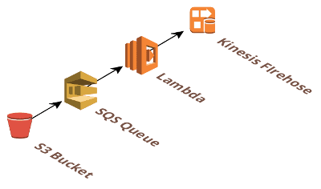

## AWS-firehose-s3-producer

AWS-firehose-s3-producer is an AWS Lambda function in Javascript that is designed to ingest
files uploaded to a S3 bucket into AWS Kinesis Firehose.

Files are uploaded to a S3 bucket which is configured to publish notifications to SQS.
SQS then triggers this lambda, which will read the file and stream it to Firehose.

## Features

 * *streams* files rather than load them to memory, therefore large files can be processed
 with minimal resources
 * gzipped files are supported

### Configuration

The Lambda requires the following environment variable to be set:
 * `FIREHOSE_STREAM_NAME`: the Kinesis firehose datastream to stream to.
 
Edit, then attach the [provided policy](policy.json) to the Role your AWS Lambda is configured to use.